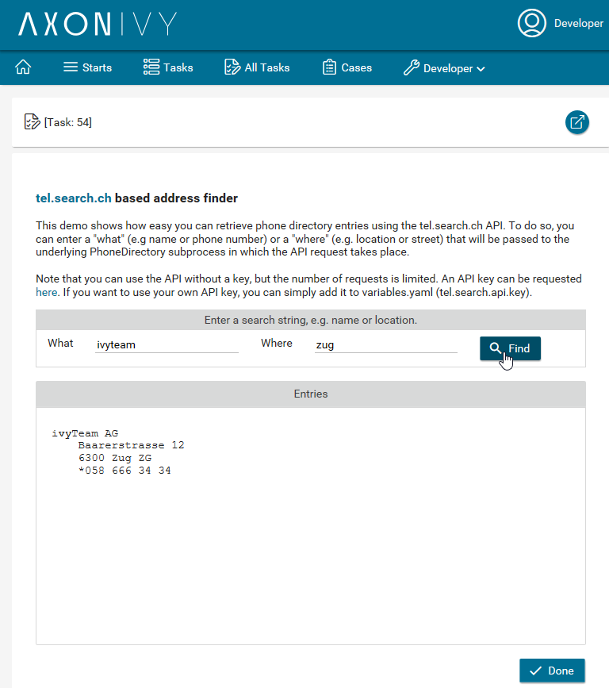

# tel.search.ch
Der Axon Ivy-Konnektor „ **” tel.search.ch** integriert das von
[tel.search.ch](https://search.ch/tel/) bereitgestellte Schweizer
Telefonverzeichnis. Dieser Konnektor verwendet einen REST-Client, mit dem Sie
Einträge aus dem Schweizer Telefonverzeichnis schnell abrufen können. Beachten
Sie, dass ohne API-Schlüssel die Anzahl der Anfragen begrenzt ist. Für eine
umfangreichere Nutzung können Sie [hier](https://tel.search.ch/api/getkey) einen
API-Schlüssel anfordern. Glücklicherweise können Sie Ihren API-Schlüssel mit
einem einzigen Klick über die Authentifizierungsfunktion des Konnektors
hinzufügen.

Dieser Konnektor ermöglicht Folgendes:

- Übergeben Sie einen Suchbegriff und rufen Sie über die API von tel.search.ch
  passende Einträge aus dem Telefonverzeichnis ab.
- Fügen Sie Ihren eigenen API-Schlüssel hinzu.
- unterstützt Sie mit einer Demo-Implementierung, um Ihren Integrationsaufwand
  zu reduzieren.

## Demo

